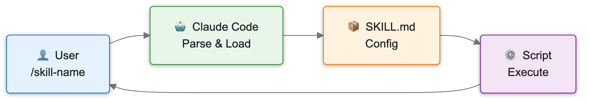

English | [中文](./README.md)

# Skills

Skills accumulated from daily learning and work, used to build personal AI Workflows.

## What are Skills?

Skills are reusable tools and scripts that enhance AI coding assistants (like Claude Code, Cursor, etc.) with specialized capabilities. Each skill is self-contained and can be easily integrated into your workflow.

## How It Works

<p align="center">
  
</p>

When you invoke a `/skill-name` command in Claude Code:

1. **Parse Command** - Claude Code identifies and parses the skill command and arguments
2. **Load Config** - Reads `SKILL.md` to get skill metadata and entry point
3. **Check Dependencies** - Verifies required dependencies are installed
4. **Execute Script** - Runs the script specified by `entry_point` (Shell or Python)
5. **Return Result** - Returns execution results to the user

## Available Skills

| Skill | Description |
|-------|-------------|
| [mermaid-to-img](./mermaid-to-img/) | Convert Mermaid diagrams to high-quality images (PNG/JPG/SVG/PDF) |
| [mac-notifier](./mac-notifier/) | Send native macOS notifications when Claude Code completes tasks or awaits input |
| [text-to-audio](./text-to-audio/) | Convert text to speech using easyVoice with multi-character dubbing support |
| [repo-analyst](./repo-analyst/) | Deep analysis of GitHub repositories with structured research reports |

## Installation

### Option 1: Direct Installation in Claude Code

1. Add the plugin marketplace:

```
/plugin marketplace add zth9/skills
```

2. Install individual skills:

```
/plugin install mermaid-to-img@zth9/skills
```

### Option 2: Using openskills Tool

```bash
openskills install zth9/skills --global
```

### Option 3: Manual Copy

Clone and copy the skill folder to your Claude Code skills directory:

```bash
git clone https://github.com/zth9/skills.git
cp -r skills/mermaid-to-img ~/.claude/skills/
```

### For Other AI Assistants

Each skill contains a `SKILL.md` file with instructions that can be used with any AI coding assistant.

## License

MIT License - see [LICENSE](./LICENSE) for details.
