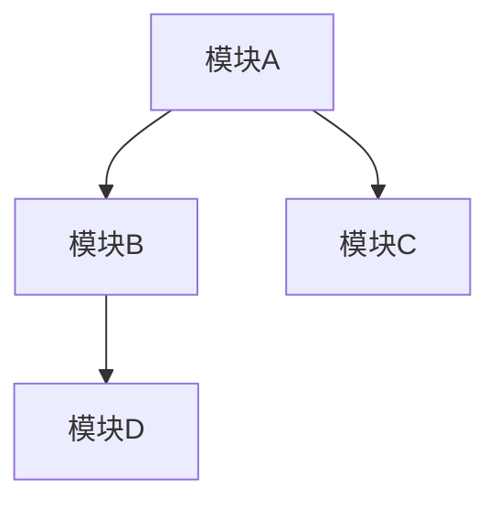

# 仓库分析报告模板

> 以下为报告输出模板，按此结构填充实际分析内容。

---

# {项目名称} 仓库深度分析报告

> **分析日期**: {YYYY-MM-DD}
> **仓库地址**: {URL}

## 执行摘要

{3-5 句话概括项目的核心定位、技术特点和当前状态}

---

## 一、项目概览（5W2H）

| 维度 | 内容 |
|------|------|
| What | {项目是什么，解决什么问题} |
| Why | {创建动机，解决的痛点} |
| Who | {维护者、核心贡献者、目标用户} |
| When | {创建时间、里程碑、发布节奏} |
| Where | {平台、生态位、分发渠道} |
| How | {安装和快速上手路径} |
| How Much | {代码量、依赖数、社区规模} |

## 二、技术栈全景

| 类别 | 技术 | 说明 |
|------|------|------|
| 语言 | | |
| 运行时 | | |
| 构建 | | |
| 测试 | | |
| Lint/Format | | |
| 包管理 | | |
| CI/CD | | |
| 容器化 | | |

## 三、架构与代码组织

### 目录结构

```
{顶层目录树，depth=2}
```

### 架构模式

{识别到的架构模式及说明}

### 模块依赖关系



### 数据流

{核心数据流描述}

## 四、核心能力与特性

### 功能列表

| 功能 | 说明 | 入口 |
|------|------|------|
| | | |

### 差异化特性

{相比同类项目的独特之处}

### 扩展机制

{插件/hooks/中间件/SDK}

## 五、代码质量与工程实践

| 维度 | 状态 | 说明 |
|------|------|------|
| 测试 | | |
| 类型检查 | | |
| Lint/Format | | |
| 文档 | | |
| 版本管理 | | |
| 安全实践 | | |

## 六、社区与生态

| 维度 | 内容 |
|------|------|
| 许可证 | |
| 治理模式 | |
| 贡献流程 | |
| 近期活跃度 | |
| 生态系统 | |
| 路线图 | |

## 七、学习路径建议

### 推荐阅读顺序

1. {入口文件} — {原因}
2. {核心模块} — {原因}
3. {辅助模块} — {原因}

### 值得深入研究的设计决策

1. {决策1}
2. {决策2}
3. {决策3}

### 首次贡献建议

{适合新手的切入点}

---

**一句话总结**: {用一句话概括这个项目的本质}
